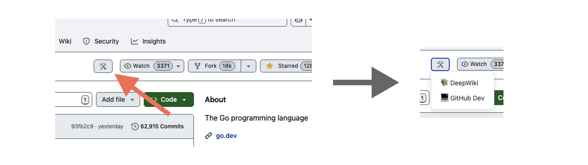

# GitHub Tools Switcher Chrome Extension

This Chrome extension allows you to quickly switch any GitHub repository URL to a variety of developer-focused tools (such as DeepWiki, GitHub.dev, etc.) while preserving the original path and query parameters.



## Features

* **Popup Menu** – Click the extension icon to open a list of tools. Selecting one instantly navigates the current GitHub tab to the chosen service.
* **Inline Toolbar** – When browsing a GitHub repository page, a small toolbar (🛠️) is injected into the repository header for one-click access to all supported tools in a new tab.
* **Non-destructive URL Transformation** – The repository path and query string are kept intact; only the domain is swapped (e.g. `github.com` → `deepwiki.com`).

## Supported Tools

| Tool | Domain | Purpose |
|------|--------|---------|
| DeepWiki | `deepwiki.com` | Wiki generation by Devin |
| GitHub Dev | `github.dev` | Web-based VS Code editor |

## Installation 

### Chrome extension store

https://chromewebstore.google.com/detail/github-tools-switcher/occmgdpelgcpejcidonjlbgniapddenk

### Development Mode

1. **Clone or download** this repository.
2. Open **chrome://extensions/** in Google Chrome.
3. Enable **Developer mode** in the top-right corner.
4. Click **Load unpacked** and choose the project folder.
5. Ensure the extension icon appears in your toolbar; pin it for quick access.

## Project Structure

```
/manifest.json      # Extension manifest v3
/popup.html         # Popup UI
/popup.js           # Popup logic (domain switch)
/content.js         # Injected toolbar on GitHub pages
/icons/             # Icon images (not included)
/public/            # Public assets like screenshots
```

## Customization

Edit the `tools` arrays in both `popup.js` and `content.js` to add, remove, or adjust services:

```
// In popup.js
{
  name: 'New Tool',
  targetDomain: 'example.com',
  description: 'Short explanation'
}

// In content.js
{
  name: 'New Tool',
  domain: 'example.com',
  icon: '🔧'
}
```

For services that mount the repo at a sub-path, include it in the domain (e.g. `githubnext.com/projects/repo-visualization`).

## License

MIT © 2025 foxytanuki 
